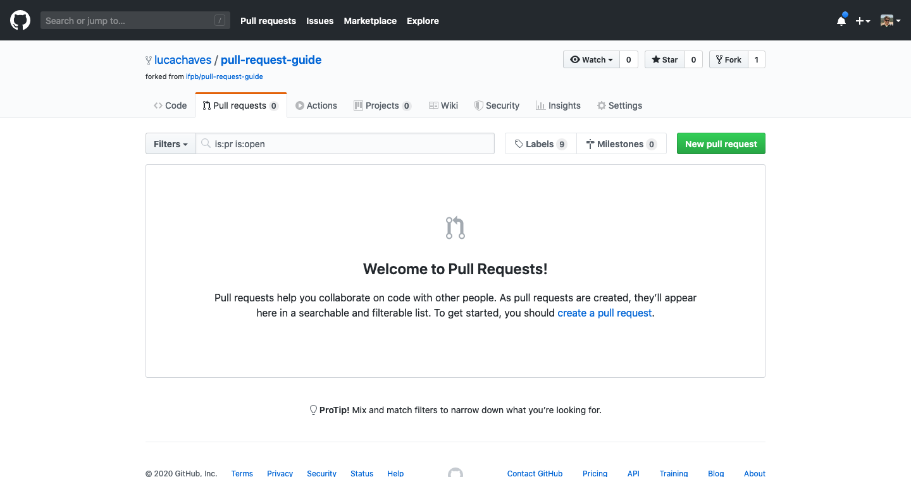
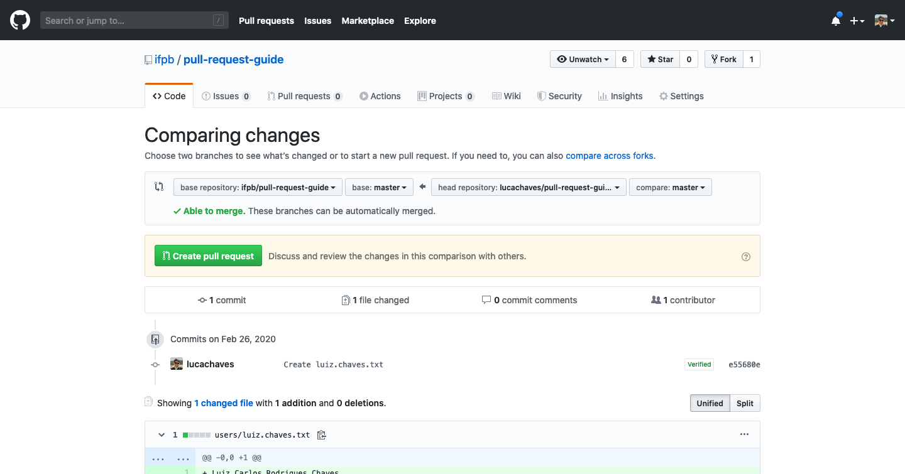
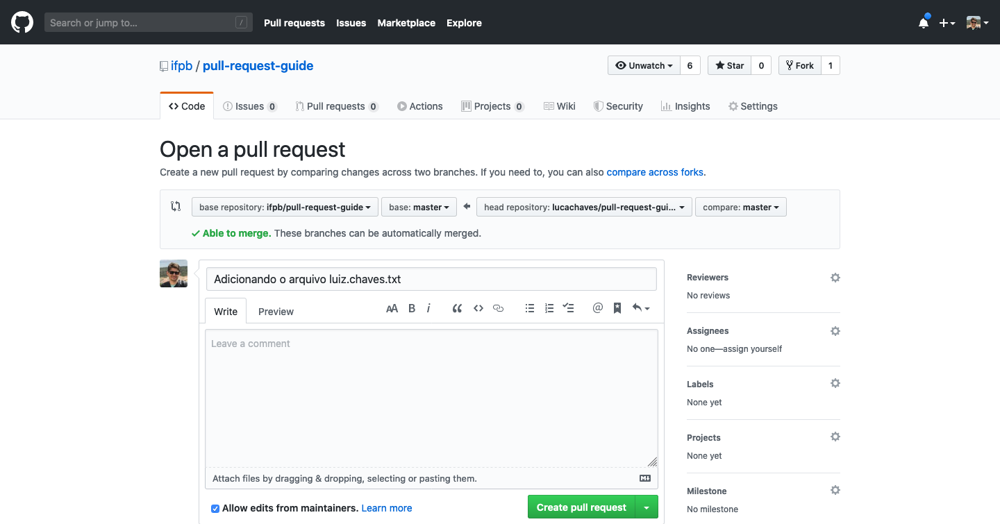

# Guia do Pull Request

Este repositório foi criado no intuito de introduzir o conceito de Pull Request (PR) para projetos da organização do IFPB do Github. Segundo o Github, [a ideia do PR](https://help.github.com/en/github/collaborating-with-issues-and-pull-requests/about-pull-requests) consiste em uma ação que facilitla a colaboração entre desenvolvedores em projetos da plataforma por meio da sugestões de mudança de código, usando um processo de diálogo e revisão com os administradores do repositório.

O Github define um passo a passo de como [criar um PR](https://help.github.com/en/github/collaborating-with-issues-and-pull-requests/creating-a-pull-request) e, para facilitar a compreensão destas etapas, será exibido a seguir alguns passos necessários para sugerir mudanças no repositório [ifpb/pull-request-guide](https://github.com/ifpb/pull-request-guide), sendo mais específico, será criado um PR para incluir um novo arquivo chamado `users/luiz.chaves.txt`:

**PASSO 1** - Acesse o repositório desejado para criar um PR, que neste caso será este próprio disponível na URL https://github.com/ifpb/pull-request-guide:


**PASSO 2** - Para contribuir é necessário criar uma cópia por meio de um fork, então o primeiro passo será fazer o login na sua conta do Github e depois acione o botão `fork`:


O resultado desta ação será a criação do repositório [lucachaves/pull-request-guide](https://github.com/lucachaves/pull-request-guide), contudo, verifique que no seu caso o fork vai gerar uma URL diferente:


**PASSO 3** - Concluido a etapa do fork a sua cópia já foi criada, nela você possui permissão para fazer alterações, entretanto, essas alteração podem ser feitas a partir do seu computador. Para baixar sua cópia clone o repositório para o seu computador:

```
$ git clone https://github.com/lucachaves/pull-request-guide.git
```

Observe que a URL do seu fork é diferente, então faça alteração no comando `git clone`.

**PASSO 4** - Ao clonar um repositório, deve-se acesse o clone e configure o seu nome e email:

```
$ cd pull-request-guide
$ git config user.name "Luiz Chaves"
$ git config user.email lucachaves@gmail.com
```

**PASSO 5** - Depois que o clone foi configurado é possível iniciar as sugestões de alteração, neste exemplo será criado o arquivo `users/luiz.chaves.txt` contendo o nome completo do usuário:

```
$ echo "Luiz Carlos Rodrigues Chaves" > luiz.chaves.txt
```

**PASSO 6** - Ao concluir a sugestão de alteração, registre no git as mudanças realizadas (delta):

```
$ git add luiz.chaves.txt
$ git commit -m 'descrição da muda'
```

Caso seja necessário incluir mais de um arquivo no registro de mudança de forma automática, é possível usar o comando:

```
$ git add -A
```

ou 

```
$ git add .
```

**PASSO 7** - Registrado a mudança no clone, vamos enviá-lo para o seu fork:

```
$ git push -u origin master
```

Para verificar se o arquivo foi enviado para o Github, acesse o seu repositório [lucachaves/pull-request-guide](https://github.com/lucachaves/pull-request-guide) e veja se o arquivo foi enviado.

Nas próximas submissões o comando `git push` pode ser usado de um modo mais compacto:

```
$ git push
```

**PASSO 8** - Pronto! O Github já recebeu sua mudança no fork [lucachaves/pull-request-guide](https://github.com/lucachaves/pull-request-guide), falta enviar a mudança como uma contribuição para o repositório original [ifpb/pull-request-guide](https://github.com/ifpb/pull-request-guide) usando um PR. A primeira etapa para criar um PR é acessar o menu `Pull Request` e clicar no botão `New pull request` no seu fork:



A próxima janela será exibida uma comparação do repositório original com o seu fork, no qual é listado os arquivos da proposta de colaboração. Para enviar é preciso abrir um PR por meio do botão `Create pull request`:



Nesta etapa dê detalhes de qual é a sua colaboração:



Ao finalizar a descrição do PR, veja que ele é exibido na lista de PR do repositório original, e será analisando pelo administrador assim que possível.

**PASSO 9** - Se no PR for solicitado alguma mudança, ou se foi dectado a necessidade de mudanças de arquivo, faça a alteração e em seguida repita os Passos 6 e 7. Quanto ao PR do Passo 9, só é preciso criar um novo caso o PR anterior tenha sido fechado ou aceito.
